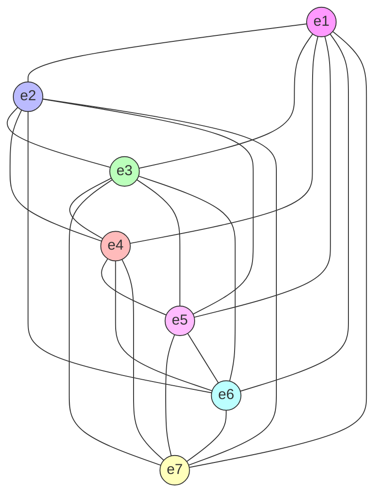

# Octonionic Computation as a Substrate for Geometric Reasoning in Machine Learning

**A Thesis for an Octonionic Reasoning Engine**

**Author:** Antonio Escalera
**Date:** March 2026
**Status:** Working Draft

---

## Abstract

We propose that the octonions (O), as the largest normed division algebra over the reals, constitute an optimal primitive substrate for encoding knowledge and performing reasoning in machine learning systems. This claim rests on a convergence of algebraic, geometric, and information-theoretic arguments: octonions maximize representational density per algebraic unit among division algebras, their non-associativity naturally encodes context-dependence, and the division algebra property guarantees that all transformations are invertible, a prerequisite for reasoning about missing or uncertain information.

We describe an architecture for a system (the "Octonionic Reasoning Engine" or ORE) that ingests heterogeneous real-time data streams, encodes them into octonionic representations whose dimensional semantics are learned rather than prescribed, and reasons by applying sequences of geometric transformations within and between octonionic spaces. We further argue that the natural geometry of the octonionic state space is hyperbolic rather than flat: the exponential volume growth of hyperbolic space provides the correct scaling for hierarchical knowledge representation, gives the "geometry of absence" (uncertainty about missing information) a rigorous formulation, and establishes a natural correspondence between an octonion's real/imaginary decomposition and the timelike/spacelike split of hyperbolic space in the hyperboloid model.

We argue this combined octonionic-hyperbolic approach enables a form of deep geometric reasoning that is fundamentally more expressive per parameter than real-valued, complex, or quaternionic alternatives, and that the algebraic ceiling imposed by Hurwitz's theorem makes octonions the natural terminus of this line of inquiry.

---

## 1. Mathematical Foundations

### 1.1 The Normed Division Algebras

The central mathematical result underlying this work is a classification theorem from abstract algebra:

**Hurwitz's Theorem (1898):** The only normed division algebras over the reals are:

| Algebra | Symbol | Dim | Associative | Commutative | Division | Zero Divisors |
|---|---|---|---|---|---|---|
| Reals | R | 1 | Yes | Yes | Yes | None |
| Complex numbers | C | 2 | Yes | Yes | Yes | None |
| Quaternions | H | 4 | Yes | No | Yes | None |
| Octonions | O | 8 | No | No | Yes | None |

Each step in the Cayley-Dickson construction doubles the dimension while sacrificing an algebraic property: C loses ordering, H loses commutativity, O loses associativity. Beyond octonions, the sedenions (S, dim 16) and all subsequent algebras lose the division property, meaning they contain zero divisors: non-zero elements whose product is zero.

The presence of zero divisors has a direct consequence for computation. If `ab = 0` where both `a != 0` and `b != 0`, then the transformation "multiply by a" irreversibly annihilates information carried by `b`. This renders sedenions and beyond fundamentally unsuitable for any architecture requiring reversible reasoning (Section 2).

Hurwitz's theorem is a proven classification, not a conjecture. No 16-dimensional normed division algebra can exist. Octonions are the terminal object in this sequence.

### 1.2 Octonionic Algebra

An octonion `x` in O is written:

```
x = x_0 + x_1*e_1 + x_2*e_2 + x_3*e_3 + x_4*e_4 + x_5*e_5 + x_6*e_6 + x_7*e_7
```

where `x_0, ..., x_7` are real and `e_1, ..., e_7` are imaginary basis units. Multiplication is defined by the **Fano plane**, a combinatorial structure encoding 7 oriented triples (see Appendix A). Each line of the Fano plane defines a quaternionic subalgebra; the full multiplication table is governed by these triples.

Key properties:

- **Alternativity:** `(xx)y = x(xy)` and `(xy)y = x(yy)` hold for all octonions, even though `(xy)z != x(yz)` in general. The subalgebra generated by any two octonions is always associative (Artin's theorem).
- **Norm preservation:** `|xy| = |x||y|`, ensuring the product of unit octonions is a unit octonion.
- **Unique inverses:** Every non-zero octonion has a unique inverse `x^{-1} = conj(x) / |x|^2`.
- **The associator** `[x,y,z] = (xy)z - x(yz)` is a totally antisymmetric trilinear form, and is itself a geometrically meaningful object.

In this implementation, multiplication is computed as a single `torch.einsum` call over the 8x8x8 structure constants tensor `C[i,j,k]`, where `(a * b)_k = sum_{i,j} C[i,j,k] * a_i * b_j`. This approach fully vectorizes over batch dimensions. See `src/octonion/_multiplication.py`.

### 1.3 The Automorphism Group G_2

The automorphism group of O is the exceptional Lie group **G_2**, a 14-dimensional compact Lie group that acts on the 7-dimensional space of imaginary octonions (Im O ~ R^7) while preserving the octonionic multiplication structure.

G_2 provides a natural symmetry group for learned transformations. A model that learns to operate within G_2 is learning transformations that respect the full algebraic structure of the octonions, analogous to how SO(3) transformations in quaternionic models respect 3D rotational geometry, but with substantially richer structure.

G_2 sits inside SO(7) (the 21-dimensional rotation group of R^7) as a proper subgroup. G_2 transformations are rotations that additionally preserve the octonionic product. This constraint imposes geometric coherence on learned transformations, reducing the parameter space from 21 to 14 dimensions while retaining all algebra-preserving degrees of freedom.

### 1.4 The Fano Plane as Computational Architecture

The Fano plane, the finite projective plane PG(2,2), encodes the octonionic multiplication table. It has 7 points, 7 lines, and its symmetry group is GL(3, F_2) of order 168.

Each line of the Fano plane defines a quaternionic subalgebra of O. There are exactly 7 such subalgebras, and they overlap: each imaginary unit belongs to exactly 3 subalgebras. This structure has several consequences:

- Any two imaginary octonions generate an associative (quaternionic) subalgebra.
- Computation within a single subalgebra is fully associative, and thus directly analogous to quaternionic ML.
- Non-associativity arises only when computing across subalgebras, i.e., when integrating information from distinct quaternionic subspaces.

The octonion therefore naturally decomposes into 7 overlapping quaternionic channels. Local computation within a channel is associative and well-understood; cross-channel computation is non-associative and introduces the richer geometric structure unique to O. This decomposition is central to the architecture described in Section 4.

---

## 2. The Reversibility Thesis

### 2.1 Reversibility as a Requirement for Reasoning Under Uncertainty

Consider the problem of reasoning about missing information. If a system has processed a data stream and built an internal representation, and then encounters a gap (missing data, a corrupted signal, an unobserved event), it must:

1. Identify that information is missing (detect the gap).
2. Characterize what kind of information is missing (bound the gap).
3. Generate candidate hypotheses for the missing content (fill the gap).
4. Evaluate those hypotheses against the world model (test the gap).

Steps 3 and 4 require running the model's transformations in reverse: "Given the current state and assuming some missing input, what prior state would be consistent?" This is only possible if the forward transformations are invertible.

In a standard neural network with ReLU activations, max-pooling, and dropout, information is irreversibly destroyed at every layer. The model cannot reason backward through its own computations because those computations are lossy. In an octonionic division algebra, by contrast, every non-zero transformation has a unique inverse. If the model's reasoning operations are octonionic multiplications and G_2 transformations, they are all invertible, and the model can run its own reasoning backward to characterize and conjecture about missing information.

### 2.2 The Geometry of Absence

When information is missing from a data stream, the octonionic world model develops a characteristic geometric signature: a region of reduced constraint in the octonionic representation space.

If the model has seen data points that constrain certain octonionic dimensions but not others, the unconstrained dimensions define a subspace of possibility. The geometry of this subspace (its dimension, its orientation relative to the constrained dimensions, its intersection with known structural invariants) encodes what the model knows about what it does not know.

More formally, given a world state `W` in O^n and a set of observed constraints `C`, the **uncertainty manifold** `U(W, C)` is the set of all octonionic states consistent with the constraints:

```
U(W, C) = { W' in O^n : C(W') = C(W) }
```

The geometry of U, specifically its tangent space, its curvature via the associator structure, and its volume relative to the full representation space, characterizes:

- **What kind** of information is missing (which octonionic dimensions are unconstrained).
- **How much** information is missing (the dimension and volume of U).
- **What structure** the missing information must have (constraints from the algebraic structure of O itself, e.g., the Moufang identities impose relations even on unconstrained dimensions).

### 2.3 Connection to Existing Work

Reversible neural networks (Gomez et al., 2017), Neural ODEs (Chen et al., 2018), and invertible flow models (Dinh et al., 2016) all exploit invertibility for various purposes. The octonionic framing generalizes these approaches: rather than engineering invertibility through architectural constraints, the algebraic substrate provides it intrinsically.

The geometry of absence connects to Bayesian uncertainty quantification, with a distinction worth noting: Bayesian methods typically represent uncertainty as probability distributions (soft, statistical), while octonionic uncertainty manifolds represent uncertainty as geometric structure (hard, algebraic). The latter may be better suited to reasoning tasks that require precise characterization of what is and is not known, closer to formal logic than to statistics.

> **Epistemic honesty note:** The claim that geometric/algebraic uncertainty representation is "more suitable" than probabilistic methods for certain reasoning tasks is a hypothesis, not a proven result. The two approaches may turn out to be complementary, or the geometric approach may have failure modes not yet identified.

---

## 3. The Density Argument

### 3.1 Representational Density Defined

We define **representational density** as the amount of geometrically structured information encodable per floating-point parameter in the algebraic substrate.

A single real number encodes 1 scalar value with no geometric structure. A complex number (2 reals) encodes a magnitude and a phase, introducing rotational geometry via U(1) symmetry. A quaternion (4 reals) encodes a 3D rotation and a scale, with geometry governed by SO(3) via the double cover SU(2). An octonion (8 reals) encodes an element of an 8-dimensional space equipped with:

- 7 overlapping quaternionic subalgebras (via the Fano plane).
- A 14-dimensional automorphism group (G_2) of structure-preserving transformations.
- A totally antisymmetric trilinear associator encoding context-dependence.
- Norm-preserving multiplication enabling information-lossless composition.

The ratio of automorphism group dimension to algebra dimension increases at each level of the Cayley-Dickson construction:

| Algebra | Params | Automorphism Group Dim | Ratio |
|---|---|---|---|
| R | 1 | 0 (trivial) | 0.0 |
| C | 2 | 1 (U(1)) | 0.5 |
| H | 4 | 3 (SO(3) / SU(2)) | 0.75 |
| O | 8 | 14 (G_2) | 1.75 |

The octonions are the only normed division algebra where the automorphism group has more dimensions than the algebra itself (by Hurwitz's theorem, this is necessarily unique). The space of structure-preserving transformations is richer than the space being transformed, a property that suggests octonions operate at a form of algebraic leverage unavailable to smaller algebras.

### 3.2 The Sedenion Boundary

The sedenions (dim 16) lose the division property, and several consequences follow simultaneously:

- Zero divisors mean some transformations irreversibly destroy information.
- The multiplication structure no longer decomposes cleanly into subalgebras.
- Norm is not multiplicative: `|xy| != |x||y|` in general.

This is a qualitative boundary, not a quantitative degradation. The mathematical properties that support the density argument (invertibility, norm preservation, clean subalgebra decomposition) all fail at dimension 16. Octonions are the final algebra where the complete set of geometric reasoning properties holds.

### 3.3 Density vs. Capacity

An important distinction: density is not capacity. A single octonion encodes 8 real parameters, substantial geometric structure per unit but still only 8 parameters. A real-valued vector of dimension 8 encodes the same amount of information (8 floats) with no algebraic structure.

The claim is not that octonions store more information in fewer bits. Rather, the structure imposed by the algebra ensures that geometric transformations on octonionic representations automatically respect structural invariants (norm preservation, Moufang identities, G_2 symmetry) that would otherwise consume model capacity to learn or enforce in a structureless real-valued representation. The algebra provides inductive bias intrinsically.

---

## 4. Architecture: The Octonionic Reasoning Engine (ORE)

### 4.1 High-Level Architecture

```mermaid
graph TD
    subgraph Ingestion["Data Ingestion Layer"]
        S1[Text/RSS]
        S2[Weather]
        S3[Markets]
        S4[Sensors]
    end

    subgraph Encoding["Octonionic Encoding Layer"]
        ENC["Learned projection: R^d -> O^n<br/>(dimensional semantics discovered, not prescribed)"]
    end

    subgraph WorldState["World State Manifold (O^n)"]
        CS[Current State]
        TM[Temporal Memory]
        UM[Uncertainty Manifold U]
        CS <--> TM <--> UM
    end

    subgraph Reasoning["Geometric Reasoning Layer"]
        G2["G_2 Transformations<br/>(structure-preserving)"]
        OC["Octonionic Composition<br/>(within & across subalgebras)"]
        IP["Inverse Projection<br/>(reversible conjecture)"]
    end

    subgraph Output["Output / Action Layer"]
        OUT[Predictions | Classifications | Signals | Alerts]
    end

    S1 & S2 & S3 & S4 --> ENC
    ENC --> WorldState
    WorldState --> Reasoning
    Reasoning --> Output
```

### 4.2 The Encoding Layer: Learned Octonionic Projection

The encoding layer maps raw data from heterogeneous streams into O^n, a space of n octonions.

A central design choice is that dimensional semantics are emergent, not assigned. The projection function `phi: R^d -> O^n` is learned end-to-end, with no prescription that a particular basis element encodes a particular feature. The training process discovers whatever dimensional assignment makes the downstream algebraic operations most effective. This is analogous to how word2vec discovered that vector arithmetic corresponded to semantic relationships, but in a richer algebraic space where the operations have more structure to exploit.

The implementation uses `OctonionDenseLinear` layers (see `src/octonion/baselines/_algebra_linear.py`) which compute linear maps that respect the octonionic multiplication structure via structure constants:

```python
# From src/octonion/baselines/_algebra_linear.py (simplified)
class OctonionDenseLinear(nn.Module):
    """Linear layer using full octonionic structure constants C[i,j,k]."""
    def forward(self, x: torch.Tensor) -> torch.Tensor:
        # x shape: [batch, in_features, 8]
        # For each (i,j) with nonzero C[i,j,k], compute F.linear on component j
        # and accumulate into output component k, weighted by C[i,j,k]
        ...
```

For the encoding projection from heterogeneous data streams to octonionic representations, the following pseudocode illustrates the intended architecture (not yet implemented):

```python
# Pseudocode: Octonionic encoding layer
# Extends OctonionDenseLinear with per-stream projections and unit-norm output
class OctonionEncoder(nn.Module):
    def __init__(self, stream_dims: dict[str, int], n_octonions: int):
        self.projections = nn.ModuleDict({
            name: OctonionDenseLinear(dim, n_octonions)
            for name, dim in stream_dims.items()
        })
        self.fusion_weights = nn.Parameter(torch.ones(len(stream_dims)))

    def forward(self, streams: dict[str, Tensor]) -> Tensor:
        encoded = sum(
            w * self.projections[name](data)
            for (name, data), w in zip(streams.items(), softmax(self.fusion_weights))
        )
        return encoded / encoded.norm(dim=-1, keepdim=True)  # Project to S^7
```

### 4.3 The World State Manifold

The world state is a point (or more precisely, a region) in O^n that evolves continuously as new data arrives.

Temporal memory is maintained by octonionic composition: the new state is formed by multiplying (in the octonionic sense) the current state with the encoded new observation, modulated by learned G_2 transformations:

```python
# Pseudocode: State update using octonionic composition
# Uses octonion_mul from src/octonion/_multiplication.py
def update_state(state: Tensor, observation: Tensor, g2_transform: Tensor) -> Tensor:
    """W_{t+1} = G(W_t) * phi(x_t), where G is a learned G_2 transformation."""
    transformed = apply_g2(state, g2_transform)  # Rotate in Im(O) preserving algebra
    return octonion_mul(transformed, observation)  # Compose via octonionic product
```

Because octonionic multiplication is norm-preserving, repeated composition does not cause the state to explode or vanish, a persistent problem in recurrent neural networks that is algebraically impossible with unit octonionic operations.

### 4.4 The Reasoning Layer: Geometric Transformations

Reasoning is performed by sequences of operations falling into three categories:

**Intra-subalgebra operations** (associative, quaternionic): These operate within one of the 7 quaternionic subalgebras defined by the Fano plane. They are computationally efficient (quaternion multiplication is well-optimized) and associative, making gradient computation straightforward.

**Cross-subalgebra operations** (non-associative, fully octonionic): These mix information across different quaternionic subspaces. The non-associativity means the order of composition matters, and the associator `[x,y,z]` measures the magnitude of this order-dependence for a given triple. This is the source of the octonionic representational advantage: it encodes context-dependence that quaternions cannot.

**Inverse projection** (reversible conjecture): Given the current state and an observed output, compute what input state would have produced it. Because all operations are invertible, this is always well-defined:

```python
# Pseudocode: Reversible conjecture via algebraic inversion
# Uses Octonion.inverse() from src/octonion/_octonion.py
def conjecture(current_state: Tensor, observed_output: Tensor,
               g2_transforms: list[Tensor]) -> Tensor:
    """Infer what input would produce observed_output given current_state."""
    hypothesized = observed_output
    # Reverse each G_2 transform (orthogonal, so inverse = transpose)
    for g in reversed(g2_transforms):
        hypothesized = apply_g2_inverse(hypothesized, g)
    # Divide out the current state to isolate the missing input
    state_inv = octonion_conjugate(current_state) / octonion_norm_sq(current_state)
    return octonion_mul(state_inv, hypothesized)
```

> **Note on non-associativity and backpropagation:** Standard backpropagation assumes the chain rule, which relies on associativity of function composition. Octonionic operations are non-associative at the algebraic level, but function composition (applying one octonionic operation after another) remains associative at the computational level. The gradient computation is valid; what changes is that the Jacobian of octonionic multiplication has additional structure from the non-commutativity and non-associativity. This is tractable: quaternionic backpropagation has been solved (Parcollet et al., 2019), and the octonionic generalization follows the same pattern with additional terms from the associator. The GHR calculus implementation (see `src/octonion/calculus/`) validates this approach, demonstrating that correct octonionic gradients match finite-difference approximations to within 1e-7 relative error. Whether this is efficient at scale remains an open empirical question.

### 4.5 Multi-Stream Data Ingestion

The system is designed to ingest heterogeneous real-time data through a unified streaming interface. Different stream types naturally map to different octonionic subspaces during the learned encoding phase. The system discovers which aspects of which streams are "aligned" in octonionic space (meaning their octonionic representations compose productively) and which are "orthogonal" (carrying independent information).

When signals across multiple streams align geometrically (their octonionic representations reinforce rather than cancel upon composition), the system is detecting a genuine cross-domain pattern. When they do not align, the associator structure characterizes how the signals fail to align, which is itself informative.

This component is planned for Phase 13 of the experimental roadmap (Section 10).

---

## 5. Signal Discovery in Streaming Data

### 5.1 The Geometric Signal Hypothesis

**Hypothesis:** In any sufficiently rich data stream, patterns that correspond to genuine causal structure form geometrically coherent structures in octonionic representation space.

This coherence manifests as:

- **Norm stability:** True signals, when encoded as octonionic sequences, compose to representations with stable (neither diverging nor collapsing) norms.
- **Subalgebra alignment:** True signals tend to occupy a consistent set of quaternionic subalgebras, meaning their octonionic representations have consistent Fano-plane structure.
- **Associator coherence:** For true signals, the associator `[x,y,z]` between consecutive observations is small or structured (lying in a low-dimensional submanifold of Im O). For noise, the associator is large and randomly oriented.

### 5.2 Noise as Geometric Incoherence

Noise, by contrast, is characterized by geometric incoherence:

- Random octonionic products distribute uniformly on S^7 without accumulating in any direction.
- The associator of random triples is generically large and uniformly distributed.
- Noisy sequences do not align with any consistent subalgebra structure.

The world model acts as a geometric filter: it amplifies inputs that are coherent with the learned octonionic structure and attenuates inputs that are not. This is a structural filter (geometrically coherent inputs are integrated; geometrically incoherent inputs are projected to the uncertainty manifold) rather than a threshold filter.

### 5.3 Learned Dimensional Semantics

The system does not preassign meanings to octonionic dimensions. Through training, each dimension (and more importantly, each subalgebra and cross-subalgebra relationship) acquires meaning by virtue of what makes the overall system most effective at its task.

The Fano plane structure plays a central role: the 7 quaternionic subalgebras provide 7 views of the data, each internally associative. The system can learn to assign different semantic roles to different subalgebras. For example, one subalgebra might capture temporal dynamics, another cross-asset correlations, a third sentiment. The assignment is discovered during training, not prescribed. The cross-subalgebra (non-associative) interactions capture the relationships between these semantic domains, precisely the kind of cross-domain reasoning that is most challenging for conventional architectures.

---

## 6. Hyperbolic Geometry of the State Space

### 6.1 Motivation: Why Flat Geometry is Insufficient

The architecture described in Section 4 implicitly assumes the world state manifold O^n carries a flat (Euclidean) metric. This is likely the wrong geometry for knowledge representation, for reasons established independently of the octonionic thesis.

**Hierarchical structure demands hyperbolic geometry.** Real-world knowledge is hierarchically organized: concepts have subconcepts, causes have effects that have further effects, abstractions generalize specifics. Trees and DAGs are the natural data structures of knowledge, but trees cannot be embedded in Euclidean space with bounded distortion because the number of nodes at depth d grows exponentially while the volume of a Euclidean ball grows only polynomially. Hyperbolic space, whose volume grows exponentially with radius, is the natural home for tree-like structures. This has been demonstrated rigorously (Sarkar, 2011) and applied successfully in ML (Nickel & Kiela, 2017; Ganea et al., 2018).

**Information geometry is naturally hyperbolic.** The Fisher information metric on statistical manifolds (the space of probability distributions) is generically hyperbolic. If the octonionic world state encodes something analogous to a distribution over possible world-states, its natural geometry inherits this negative curvature.

**Scale separation is intrinsic.** In hyperbolic space, distance from the origin has a natural interpretation as level of abstraction. Points near the origin represent general, abstract concepts; points near the boundary represent specific, concrete observations. The exponential expansion ensures fine-grained distinctions exist at the periphery without consuming representational capacity at the center.

### 6.2 Three Formulations

There are at least three distinct ways to combine octonionic algebra with hyperbolic geometry, ranging from pragmatic to exotic.

#### Option A: Poincare Ball in O (Pragmatic)

Model the state space as the open unit ball `B^8 = { x in O : |x| < 1 }` equipped with the Poincare metric:

```
ds^2 = 4|dx|^2 / (1 - |x|^2)^2
```

The octonionic algebraic structure is preserved (addition and multiplication remain defined), but the metric, which governs distance measurement, neighborhood definition, and gradient computation, is hyperbolic.

The key modification is replacing Euclidean operations with their Mobius gyrovector counterparts. For Mobius addition:

```
x (+) y = ((1 + 2<x,y> + |y|^2)*x + (1 - |x|^2)*y) / (1 + 2<x,y> + |x|^2*|y|^2)
```

**Advantages:** Well-understood framework; existing Poincare embedding tooling adapts directly.
**Limitation:** The Mobius operations do not interact cleanly with octonionic multiplication. Mobius addition and octonionic product live in different mathematical frameworks, requiring reconciliation of two separate algebraic structures.

#### Option B: Hyperboloid Model via Split Signature (Selected First Approach)

An octonion has a natural decomposition: 1 real part + 7 imaginary parts. Introducing the Lorentzian inner product:

```
<x, y>_L = x_0*y_0 - x_1*y_1 - x_2*y_2 - ... - x_7*y_7
```

defines the hyperboloid `H^7 = { x in O : <x,x>_L = 1, x_0 > 0 }` as a model of 7-dimensional hyperbolic space embedded directly in the octonion.

This is compelling because the real/imaginary split of the octonion aligns with the timelike/spacelike split of Minkowski space. Octonionic conjugation `x -> conj(x)` flips the sign of the imaginary part, which is precisely the spatial reflection (parity) operation in the Lorentzian picture.

In this formulation, the real part of the octonion encodes the radial position in hyperbolic space, interpretable as the abstraction level or depth in the knowledge hierarchy. Points on the hyperboloid with large `x_0` (dominant real part) are deep in the hierarchy; points with `x_0 ~ 1` (small imaginary components) are near the apex.

Octonionic multiplication gains a new interpretation: multiplying two octonions composes their imaginary (spatial/conceptual) components and their real (hierarchical depth) components. The norm relation `|xy| = |x||y|` ensures that composing concepts at comparable depths stays at approximately that depth (modulo the interaction of the imaginary parts).

**Advantage:** The hyperbolic structure is intrinsic to the octonion. The real/imaginary decomposition serves double duty as both the algebra's conjugation structure and the geometry's timelike/spacelike split.

**A tension requiring resolution:** The Lorentzian norm `<x,x>_L` is distinct from the octonionic (Euclidean) norm `|x|^2 = x_0^2 + sum(x_i^2)`. Octonionic multiplication preserves the Euclidean norm, not the Lorentzian one. Consequently, octonionic multiplication moves points off the hyperboloid, necessitating a re-projection step after each multiplication. Whether this re-projection preserves the algebraic properties the architecture depends on (particularly invertibility) requires careful analysis. This is the central open problem of the hyperbolic-octonionic synthesis, addressed experimentally in Phase 12 of the roadmap.

#### Option C: The Octonionic Hyperbolic Plane OH^2 (Exotic)

The octonionic projective plane OP^2 (Cayley plane) is a 16-dimensional Riemannian manifold whose isometry group is the compact exceptional Lie group F_4. Its non-compact dual, OH^2, has isometry group F_{4(-20)} and is a rank-1 symmetric space of non-compact type: a hyperbolic space built intrinsically from octonions.

OH^2 is 16-dimensional, meaning a single point encodes 2 octonions' worth of information. Its sectional curvatures range between -4 and -1 (pinched negative curvature), meaning it is "more hyperbolic" in some directions than others by a factor of 4.

This is the most mathematically natural octonionic hyperbolic space, but also the most computationally challenging. The Riemannian exponential and logarithmic maps on OH^2 involve octonionic matrix operations (specifically, operations on 3x3 Hermitian matrices over O, the Jordan algebra construction), and the non-associativity makes these computations delicate.

> **Epistemic honesty note:** Option C is mathematically elegant but may not be computationally tractable for ML training. The machinery of exceptional symmetric spaces is deep and the numerical analysis has not been worked out for gradient-based optimization. This formulation is deferred to future research beyond the current experimental roadmap.

### 6.3 The Hybrid Hyperboloid-Octonionic Model

The selected first approach is a modified Option B that explicitly addresses the Euclidean-vs-Lorentzian tension by separating the algebraic and metric roles of the octonion:

1. **Octonionic algebra** governs how states compose: how new observations are integrated with existing knowledge, how transformations chain, and how conjecture works (Section 4.4). These operations use the standard octonionic product with the Euclidean norm.

2. **Hyperbolic geometry** governs how states are measured and compared: distances, neighborhoods, gradients, and the loss function. The state space is equipped with the hyperboloid metric.

3. **The bridge** between them is a learned projection: after each octonionic composition step, the result is projected back onto the hyperboloid. The projection itself is parameterized (as a G_2-equivariant map) and trained jointly.

```python
# Pseudocode: Hybrid state with octonionic algebra + hyperboloid geometry
# Builds on octonion_mul from src/octonion/_multiplication.py
class HyberbolicOctonionState:
    oct: Tensor   # Octonionic value (for algebraic operations)
    hyp: Tensor   # Hyperboloid coordinates satisfying <hyp,hyp>_L = 1

    def compose(self, observation: Tensor, g2_transform: Tensor):
        # Step 1: Octonionic composition (algebraic)
        transformed = apply_g2(self.oct, g2_transform)
        self.oct = octonion_mul(transformed, observation)
        # Step 2: Re-project to hyperboloid (geometric)
        self.hyp = project_to_hyperboloid(self.oct)

def project_to_hyperboloid(x: Tensor) -> Tensor:
    """Project an octonion onto H^7 preserving imaginary direction."""
    im = x[..., 1:]  # Imaginary components
    im_norm_sq = (im ** 2).sum(dim=-1, keepdim=True)
    real = torch.sqrt(1.0 + im_norm_sq)
    return torch.cat([real, im], dim=-1)
```

### 6.4 What Hyperbolic Geometry Contributes to the Architecture

Revisiting the specific components of the ORE architecture with hyperbolic geometry:

**World State Manifold (Section 4.3):** The world state lives on H^7n (a product of n copies of H^7). Each octonionic component's real part encodes abstraction level. Raw sensory observations project near the apex (low real part), while high-level patterns and abstractions have large real parts. The exponential volume growth provides exponentially more capacity for concrete details than for abstract summaries, which correctly reflects the structure of knowledge (there are exponentially more specific facts than general principles).

**The Geometry of Absence (Section 2.2), formalized:** In hyperbolic space, the boundary at infinity (the ideal boundary of H^7) represents the limit of increasingly specific information. Missing information corresponds to directions toward the boundary that the model has not explored. The exponential divergence of geodesics in hyperbolic space means that two directions of missing information that are close at the level of abstract concepts become exponentially separated at the level of specific predictions. This gives the uncertainty manifold a concrete, computable structure:

```
U(W, C) ~ { directions in T_W(H^7n) not constrained by C }
```

The hyperbolic metric on this tangent space means the volume of uncertainty grows exponentially with the dimension of what is unknown, which is the correct scaling for uncertainty about hierarchically structured knowledge.

**Signal Detection (Section 5):** In hyperbolic space, noise concentrates near the boundary (as unstructured high-specificity data) while true signals propagate inward (creating structure at higher levels of abstraction). The hyperbolic metric amplifies distances near the boundary, rendering noise metrically prominent but geometrically peripheral. True signals, which create coherent structure at multiple abstraction levels, trace geodesics that move radially inward from specific observations toward general patterns. This radial coherence serves as a distinguisher of genuine patterns from noise.

**Temporal Memory (Section 4.3):** Past observations naturally drift outward in hyperbolic space as they become older and more specific to their moment. More durable patterns, regularities that persist across observations, are reinforced at more interior (higher abstraction) positions. The hyperbolic geometry itself implements a form of episodic-to-semantic memory transition.

### 6.5 Connections to Exceptional Structures

The combination of octonionic algebra and hyperbolic geometry activates several exceptional mathematical structures that suggest avenues for future generalization:

- **F_4 and the Jordan algebra J_3(O):** The 3x3 Hermitian matrices over O form the exceptional Jordan algebra, whose automorphism group is F_4. If the architecture were extended to use 3x3 octonionic Hermitian matrices as state representations (instead of single octonions), the natural symmetry group would increase from G_2 (14-dim) to F_4 (52-dim), a substantial increase in geometric structure per parameter.

- **E_6, E_7, E_8:** The magic square of Freudenthal-Tits constructs the exceptional Lie groups E_6, E_7, E_8 from pairs of division algebras. These groups appear in string theory and in the classification of symmetric spaces. If the octonionic approach proves fruitful, these exceptional structures represent natural extensions for richer geometric models.

These extensions are noted as research directions, not proposed implementations. The appearance of exceptional Lie groups suggests the octonionic approach is an entry point to a rich family of exceptional geometric models, but mathematical coherence is not equivalent to computational utility.

> **Epistemic honesty note:** The appearance of exceptional Lie groups does not, by itself, validate the approach. Mathematically beautiful systems can be computationally useless. The exceptional structures are a positive signal (suggesting deep mathematical coherence) but not evidence (which requires experiments). The risk of mathematical aesthetics outpacing empirical grounding warrants sustained vigilance.

---

## 7. Training and Optimization

### 7.1 The Octonionic Gradient

Differentiation in non-associative algebras requires care. The key result underlying this work is the **Generalized Hamilton-Real (GHR) calculus**, extending the HR calculus (used for quaternionic networks) to octonions. The gradient of a real-valued loss function `L(W)` with respect to octonionic parameters `W` in O^n can be computed as:

```
dL/dW = (dL/dw_0) + (dL/dw_1)*e_1 + ... + (dL/dw_7)*e_7
```

where each `dL/dw_k` is a standard real partial derivative. This is computationally equivalent to treating octonions as R^8 for gradient purposes, while the forward pass uses the full octonionic algebraic structure.

The implementation (see `src/octonion/calculus/_ghr.py`) uses the Wirtinger-like derivative pair `(df/do, df/do*)` with a 1/8 normalization factor (the octonionic extension of the quaternionic 1/4). For real-valued loss functions, the optimization gradient is the conjugate derivative `dL/do*`, and left and right derivatives coincide. The rotation well-definedness required by the GHR framework is guaranteed by the Moufang identity, which ensures that `mu * q * mu^{-1}` is unambiguous despite non-associativity.

The algebraic benefits of octonions (structured composition, invertibility, G_2 symmetry) are realized in the forward pass, while standard real-valued optimization applies in the backward pass. The non-associativity affects the forward computation graph but not the gradient computation itself.

### 7.2 Loss Functions for Geometric Reasoning

The loss function should reward geometric coherence in addition to predictive accuracy:

```python
# Pseudocode: ORE loss combining prediction accuracy with geometric regularization
# Builds on octonion_mul and associator from src/octonion/
def ore_loss(predicted, actual, world_state, uncertainty_dim,
             w_pred=1.0, w_coherence=0.1, w_uncertainty=0.01, w_invert=0.1):
    # Task-specific prediction loss
    loss = w_pred * mse_loss(predicted, actual)
    # Coherence: associators of world state triples should be structured
    loss += w_coherence * associator_entropy(world_state)
    # Parsimony: prefer lower-dimensional uncertainty manifolds
    loss += w_uncertainty * uncertainty_dim
    # Invertibility: forward(inverse(x)) should recover x
    loss += w_invert * forward_inverse_roundtrip_error(world_state)
    return loss
```

### 7.3 G_2-Equivariant Layers

To ensure learned transformations respect octonionic structure, they are parameterized as elements of G_2 (or its Lie algebra g_2):

```python
# Pseudocode: G_2 transformation parameterized via Lie algebra
# 14 parameters (dim of G_2), mapped to SO(7) rotation preserving octonionic product
class G2Transform(nn.Module):
    def __init__(self):
        self.params = nn.Parameter(torch.zeros(14))  # Lie algebra coordinates

    def matrix(self) -> Tensor:
        """Exponentiate from g_2 to G_2 via the 14 basis elements of g_2 in so(7)."""
        return lie_exp(g2_basis, self.params)

    def forward(self, x: Tensor) -> Tensor:
        """Apply as SO(7) rotation to imaginary part, preserving real part."""
        m = self.matrix()
        real, imag = x[..., :1], x[..., 1:]
        return torch.cat([real, imag @ m.T], dim=-1)
```

The 14 parameters of a G_2 transformation (vs. 21 for an unconstrained SO(7) rotation) encode precisely the algebra-respecting rotations. This is a concrete example of the density argument: 14 parameters yield a transformation that automatically preserves all octonionic structure, while 21 parameters yield an unconstrained rotation that may violate it.

---

## 8. Open Questions and Risks

This section catalogues the unresolved questions and risks that the experimental program must address.

### 8.1 Optimization Landscape

**Q: Does octonionic non-associativity create pathological optimization landscapes?**

The loss surface of an octonionic model may have qualitatively different properties from real-valued or quaternionic models. Non-associativity means that the order of composition in the forward pass matters, potentially creating sharp, non-smooth features in the loss landscape.

**Mitigation:** Artin's theorem guarantees that any two octonions generate an associative subalgebra. Pairwise interactions are therefore well-behaved; pathology can only arise from three-way or higher interactions. Phase 5 of the experimental roadmap addresses this question empirically through Hessian eigenspectrum analysis, curvature measurement, and gradient variance characterization. The results of Phase 5 serve as a go/no-go gate for the remainder of the experimental program.

### 8.2 Scaling Behavior

**Q: How does representational density scale with model size?**

The 14/8 = 1.75 density ratio (Section 3.1) is computed for a single octonion. Whether this ratio is maintained, improved, or degraded when scaling to O^n for large n remains unclear. The interactions between octonionic units in a large model may or may not preserve the per-unit density advantage.

### 8.3 Numerical Stability

**Q: Is octonionic computation numerically stable in finite-precision arithmetic?**

The non-associativity means that `(xy)z` and `x(yz)` give genuinely different results, even in exact arithmetic. In floating-point, the rounding behavior of these two groupings differs, potentially amplifying numerical errors in ways that do not occur in associative algebras.

**Mitigation:** Phase 4 of the experimental roadmap characterizes this quantitatively. The `StabilizingNorm` module (see `src/octonion/baselines/_stabilization.py`) implements periodic unit-norm re-normalization, which extends stable depth by 2.5-5x depending on the algebra.

### 8.4 The "Why Not R^8?" Challenge

**Q: Can a sufficiently large real-valued model learn the same representations?**

The universal approximation theorem guarantees that a large enough real-valued network can approximate any function. The octonionic claim is not that R^8 cannot learn what O encodes, but that O provides sufficient inductive bias that the octonionic model will learn faster, with fewer parameters, and with better generalization. This is an empirical claim requiring experimental validation. The experimental design includes an R^8 dense mixing baseline in every comparison specifically to guard against this objection (see `src/octonion/baselines/_dense_mixing.py`).

### 8.5 The Non-Associativity Trade-off

**Q: Is non-associativity a feature or a limitation?**

This work argues it is a feature (encoding context-dependence and richer geometry). However, non-associativity also means that certain standard architectural patterns (deep composition chains, attention mechanisms) require rethinking. The computational overhead of tracking parenthesization in deep networks may offset the representational advantage. The GHR calculus implementation demonstrates that correct gradients are tractable (Section 7.1), but efficiency at scale remains to be determined.

### 8.6 Grounding the Geometry of Absence

**Q: Is the uncertainty manifold concept formally well-defined and computable?**

The description in Section 2.2 is suggestive but lacks formal rigor. A complete formulation must specify: how is the constraint set C defined? Is the uncertainty manifold U(W, C) a smooth manifold or something more pathological? Can its geometry (dimension, curvature) be efficiently computed or approximated? The hyperbolic formulation (Section 6.4) provides more structure (tangent space directions in H^7n are better behaved than in flat space), but the fundamental questions remain open. Phase 10 of the experimental roadmap tests this concept empirically through predict-and-fill benchmarks.

### 8.7 The Hyperboloid Projection Problem

**Q: Does re-projection onto the hyperboloid after octonionic multiplication destroy the algebraic properties required by the architecture?**

This is the central open problem of Section 6. Octonionic multiplication preserves the Euclidean norm, not the Lorentzian norm. The hyperboloid is defined by the Lorentzian norm. After multiplying two hyperboloid points as octonions, the result is off-hyperboloid and must be projected back. The projection preserves imaginary direction but recomputes the real part, meaning the real part (interpreted as abstraction level) becomes determined by the imaginary parts rather than independently controllable. Whether this constitutes a feature (the algebra determines the abstraction level) or a limitation (a degree of freedom is lost) is unclear. Furthermore, the question of whether `project(a * b) ~ project(a) *_H project(b)` for some natural hyperboloid operation `*_H` must be answered empirically. Phase 12 of the experimental roadmap is dedicated to this characterization.

### 8.8 Numerical Stability in Hyperbolic Space

**Q: Do hyperbolic coordinates amplify the floating-point issues from Section 8.3?**

Hyperbolic space is challenging for floating-point arithmetic. The `cosh` and `sinh` functions grow exponentially, so points far from the origin require exponentially large coordinate values. The Poincare ball model avoids this (all coordinates are in [0,1)) but introduces the complementary problem of requiring exponentially fine precision to distinguish points near the boundary. Both issues are documented in the hyperbolic ML literature and have engineering solutions (logarithmic coordinates, mixed-precision arithmetic), but their interaction with octonionic computation has not been studied.

---

## 9. Experimental Roadmap

The experimental program proceeds bottom-up, validating each theoretical claim with controlled experiments before building on it. All experiments use Python with PyTorch and ROCm acceleration on AMD GPU hardware.

### Phase 1: Octonionic Algebra
Implement and rigorously test the core octonionic algebra library. Verify Moufang identities on 10,000+ random triples, norm preservation to 1e-12, Cayley-Dickson/Fano cross-check, inverse correctness, and alternativity. *(Complete.)*

### Phase 2: GHR Calculus
Implement octonionic backpropagation via GHR Wirtinger formalism. Verify custom autograd backward pass matches finite-difference gradients to 1e-5 on single-layer and 5-layer compositions with mixed parenthesization. Demonstrate that naive (associativity-assuming) chain rule produces wrong gradients. Verify GPU/CPU parity. *(Complete.)*

### Phase 3: Baseline Implementations
Build fair comparison networks for R, C, H, O with matched parameter counts (<1% deviation), identical architecture skeleton, and algebra-specific batch normalization. Include training infrastructure with gradient statistics and statistical testing. *(Complete.)*

### Phase 4: Numerical Stability
Characterize precision degradation across depths (10, 50, 100, 500 layers), measure condition numbers, compare float32 vs float64, and validate mitigation strategies. *(Complete.)*

### Phase 5: Optimization Landscape (Go/No-Go Gate)
Characterize gradient variance across 20+ seeds, Hessian eigenspectrum at convergence, convergence profiles across 3+ optimizers, and determine whether octonionic networks converge to solutions within 2x loss of R^8 baseline. This phase serves as an explicit go/no-go gate: if non-associativity creates pathological loss surfaces, the project pivots to documenting a quantitative negative result. *(Experiments running.)*

### Phase 6: Reversibility Claim
Test algebraic inversion quality vs. RevNet/INN baselines on synthetic tasks with known forward models and ground-truth inverses. Measure reconstruction fidelity as a function of depth and noise level.

### Phase 7: Density and Geometric Claims
Run matched-parameter density comparisons across R/C/H/O on 3+ tasks with statistical significance testing. Test geometric signal detection on synthetic data with planted geometric structure. Include R^8 dense mixing baseline in every comparison.

### Phase 8: G_2 Equivariance and Hyperbolic Hybrid
Implement G_2-equivariant layers and verify numerical equivariance. Implement the hyperboloid-octonionic hybrid model (Option B from Section 6.2). Test on hierarchical data against Poincare embedding baselines.

### Phase 9: Associator and Subalgebra Analysis
Investigate whether non-associativity carries useful information by building associator-aware architectures that use `[a,b,c]` as an attention, regularization, or gating signal. Decompose trained representations along the 7 Fano plane subalgebras to test for specialization.

### Phase 10: Predict-and-Fill Benchmarks
Validate the geometry of absence through predict-and-fill tasks where the model must identify missing data dimensions and generate plausible completions via inverse projection. Test whether uncertainty manifold geometry correlates with the amount and type of missing information.

### Phase 11: Applied Single-Stream Benchmarks
Test octonionic representations on practical tasks beyond synthetic data: anomaly detection in noisy time series, multi-step forecasting. Compare against LSTM and Transformer baselines with matched parameter counts. Quantitatively test the geometric signal hypothesis on real-valued time series.

### Phase 12: Hyperboloid Projection Stability
Empirically characterize the central open problem of the hyperboloid-octonionic synthesis. Measure projection distortion `|project(a*b) - project(a) *_H project(b)|` for random and structured inputs. Quantify invertibility degradation after repeated re-projection. Identify and evaluate mitigation strategies.

### Phase 13: Multi-Stream Data Fusion
Build an ORE proof-of-concept ingesting at least 3 heterogeneous data streams (e.g., financial markets, news sentiment, temporal events). Validate cross-stream geometric signal detection. Analyze Fano plane subalgebra specialization across stream types.

---

## 10. Conclusion

The octonionic reasoning engine sits at the intersection of abstract algebra, differential geometry, and machine learning. The mathematical arguments supporting this approach are:

1. **Hurwitz's theorem provides a hard ceiling.** Octonions are the last normed division algebra. If the program of using richer algebras for richer representations is viable, it terminates here.

2. **The density ratio is unique.** No other algebra achieves an automorphism-to-dimension ratio above 1; octonions achieve 1.75.

3. **Invertibility is algebraically guaranteed.** Every non-zero octonion has a unique inverse, enabling reversible reasoning without architectural constraints.

4. **The Fano plane provides natural multi-view decomposition.** Seven overlapping quaternionic subalgebras give the model 7 internally-associative perspectives on its data, with non-associative cross-talk encoding context-dependence.

5. **Non-associativity encodes order-dependence.** The associator `[a,b,c] = (ab)c - a(bc)` measures a fundamental truth: the order and grouping of reasoning steps matters. The difference between groupings is itself an informative geometric signal.

Whether these mathematical properties translate into practical ML advantages is an empirical question. This thesis provides the theoretical foundation and architectural blueprint; the experimental roadmap (Section 9) charts the path to evidence.

---

## References

- Baez, J. C. (2002). "The Octonions." *Bulletin of the AMS*, 39(2), 145-205.
- Bill, J. & Cox, B. (2024). "Exploring Quaternion Neural Network Loss Surfaces." *Advances in Applied Clifford Algebras*, 34.
- Chen, R. T. Q., et al. (2018). "Neural Ordinary Differential Equations." *NeurIPS*.
- Conway, J. H. & Smith, D. A. (2003). *On Quaternions and Octonions*.
- Dinh, L., Sohl-Dickstein, J., & Bengio, S. (2016). "Density estimation using Real-NVP." *ICLR*.
- Ganea, O., Becigneul, G., & Hofmann, T. (2018). "Hyperbolic Neural Networks." *NeurIPS*.
- Gomez, A. N., et al. (2017). "The Reversible Residual Network." *NeurIPS*.
- Harvey, F. R. (1990). *Spinors and Calibrations*. Academic Press.
- Nickel, M. & Kiela, D. (2017). "Poincare Embeddings for Learning Hierarchical Representations." *NeurIPS*.
- Parcollet, T., et al. (2019). "Quaternion Recurrent Neural Networks." *ICLR*.
- Sarkar, R. (2011). "Low Distortion Delaunay Embedding of Trees in Hyperbolic Plane." *GD 2011*.
- Springer, T. A. & Veldkamp, F. D. (2000). *Octonions, Jordan Algebras and Exceptional Groups*. Springer.
- Ungar, A. A. (2008). *Analytic Hyperbolic Geometry and Albert Einstein's Special Theory of Relativity*. World Scientific.
- Wu, J., et al. (2020). "Deep Octonion Networks." *Neurocomputing*, 397, 179-191.
- Xu, D. & Mandic, D. P. (2015). "The Theory of Quaternion Matrix Derivatives." *IEEE Transactions on Signal Processing*, 63(6), 1543-1556.
- Zhang, A., et al. (2021). "Beyond Fully-Connected Layers with Quaternions: Parameterization of Hypercomplex Multiplications with 1/n Parameters." *ICLR*.

---

## Appendix A: The Fano Plane

The Fano plane is the finite projective plane PG(2,2), encoding the octonionic multiplication table. It has 7 points (corresponding to the imaginary basis units e_1 through e_7) and 7 lines (including one inscribed circle).



The 7 oriented triples (lines of the Fano plane): (1,2,3), (1,4,5), (1,7,6), (2,4,6), (2,5,7), (3,4,7), (3,6,5). Each triple defines a quaternionic subalgebra: `e_i * e_j = e_k` (oriented cyclically). Anti-cyclic products carry a negative sign: `e_j * e_i = -e_k`.

Each imaginary unit belongs to exactly 3 of the 7 subalgebras, and any two imaginary units share exactly 1 subalgebra (in which their product is associative). Non-associativity arises only when three imaginary units span more than one subalgebra.

## Appendix B: G_2 as a Subgroup of SO(7)

G_2 is the stabilizer of the 3-form:

```
omega = e^{123} + e^{145} + e^{176} + e^{246} + e^{257} + e^{347} + e^{365}
```

where `e^{ijk} = e^i ^ e^j ^ e^k` are basis 3-forms on R^7 (the imaginary octonions). This 3-form encodes the entire octonionic multiplication table: preserving it is equivalent to preserving the octonionic algebra structure.

G_2 has 14 generators (= dim SO(7) - 7 constraints from omega), and every G_2 element is an SO(7) rotation that additionally preserves the cross product on Im O.
